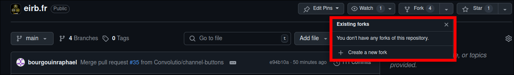

# Github Eirbware

Eirbware dispose d'une [organisation github](https://github.com/Eirbware), qui permet de centraliser et gérer plus facilement les dépôts des services que l'on propose, ainsi que de rendre le tout open-source.

L'intérêt du open-source (au delà de la transparence) est que n'importe qui peut contribuer à améliorer un service, et cela par le biais de **pull requests**

## Comment contribuer?

Pour contribuer, il y a 3 étapes à suivre: 

* Faire un **fork** du dépôt voulu



Ceci va créer un dépôt ayant étant une copie du dépôt original mais dont vous êtes le contributeur. 
Ainsi, toutes les modifications qui y sont faites ne l'affecteront pas.

* Implémenter le changement 

Pour cela, dans le dépôt principal, il est possible d'ajouter une remote ayant l'adresse du fork, avec la commande suivante:
```title="Ajout de dépôt fork en remote"
git remote add <nom_remote> <url_remote>
```
Ensuite, il faut créer une nouvelle branche (via la commande `git switch -c <nom_branche>`), qui sera la branche de travail.
Une fois les modifications implémentées, il ne reste plus qu'à push la branche sur la remote de la fork avec la commande `git push -u <nom_remote> <nom_branche>` (et non `git push -u origin <nom_branche>` comme fait habituellement).

* Faire une **pull request**


Une pull request est une demande de merge de la branche sélectionée du fork vers le dépôt original.

Après cela, un membre d'Eirbware vérifiera que ce qui a été ajouté avant d'accepter, de refuser ou de demander des modifications sur les changements apportés.

